# InfraGraph AI

**Multimodal Infrastructure Diagram Intelligence + Enterprise Graph RCA + Agentic Remediation on AMD ROCm**

InfraGraph AI is a multimodal Agentic AIOps system built for the TCS & AMD AI Hackathon using open-source models and AMD ROCm-ready workflows.
It performs multimodal diagram-to-graph intelligence with RF-DETR-based / RF-DETR-supported diagram detection, verified annotation fallback, vision connector extraction, and enterprise graph memory stitching.
It correlates alert storms with graph-aware event features, builds engineered RCA features, and ranks root cause with Enterprise GNN RCA V1 GraphSAGE plus Enterprise GNN RCA V2 - Temporal Relation-Aware GraphSAGE.
It uses a calibrated confidence gate, retrieves root-cause-aware runbook/SOP evidence, and uses Qwen/vLLM only after RCA for grounded remediation drafting.
It validates plans with a governance critic, creates local demo ITSM drafts, and keeps all remediation behind a human approval gate.
Guardrail: the LLM is not used to decide root cause.

InfraGraph AI is a graph-native Agentic AIOps pipeline that transforms static infrastructure diagrams into enterprise graph memory, correlates alert storms into incident clusters, ranks root cause with engineered graph features and Temporal Relation-Aware GraphSAGE, and uses Qwen/vLLM only for governed, runbook-grounded remediation.

## Submission Snapshot

| Item | Details |
|------|---------|
| Project | InfraGraph AI |
| Hackathon alignment | Agents / Agentic AI, Multimodal AI, Fine-tuning & Alignment |
| Primary use-case mapping | Autonomous Incident Diagnosis & Resolution Agent; Unified Observability & RCA Agent; Telecom/NOC Copilot style operations assistant |
| Core demo story | Diagram -> graph memory -> enterprise graph -> alert correlation -> V2 GNN RCA -> calibrated confidence -> runbook-grounded Qwen remediation -> governance -> human approval -> ITSM draft |
| Demo anchor scenario | `enterprise_v3_0079` |
| Demo root cause | `DC-FW-01` in `datacenter_topology` |
| Core RCA model | `EnterpriseRcaTemporalRelGNN` - Temporal Relation-Aware GraphSAGE |
| AMD evidence | Enterprise GNN RCA V2 run on AMD Instinct MI300X / ROCm + Qwen3 GRPO/vERL evidence |
| LLM role | Qwen/vLLM is used only after RCA for grounded remediation drafting |
| Safety controls | Calibrated confidence gate, governance critic, runbook chain, human approval |

## Submission Links

- Demo video: `<to be added>`
- Final presentation: `<to be added>`
- Code repository: `https://github.com/DebalekhaChakraborty/infragraph-ai`

## 1. Objective

NOC, SRE, platform, and infrastructure teams usually receive alerts, tickets, diagrams, runbooks, and tribal knowledge in separate systems. Static architecture diagrams are visually useful but not machine-readable, so every major incident still requires humans to map alerts back to topology dependencies by hand.

InfraGraph AI turns diagrams into an operational graph brain. Instead of asking an LLM to guess a root cause, the system extracts topology, builds graph memory, correlates alert evidence, and uses graph intelligence to produce explainable RCA candidates. The LLM is used downstream for remediation planning, not for inventing the diagnosis.

## 2. Hackathon Track Alignment

| Track | Fit |
|-------|-----|
| Primary: Agents / Agentic AI | A schema-validated multi-step incident operations orchestrator moves from alert intake through graph-aware correlation, RCA, confidence calibration, runbook-grounded remediation, governance review, ITSM draft, and human approval. |
| Secondary: Multimodal AI | Diagram intelligence ingests infrastructure images, detector output, verified annotations, OCR/connector evidence, and graph memory. |
| Additional: Fine-tuning / alignment | Qwen3 LoRA + GRPO/vERL alignment pipeline trains remediation behavior with graph-grounded reward functions. |

Relevant use-case alignment:

- Autonomous Incident Diagnosis & Resolution Agent
- Unified Observability & RCA Agent
- Intelligent Image & Signal Processing
- Telecom/NOC Copilot style operations assistant

## 3. What We Built

- **Diagram Intelligence:** infrastructure diagram ingestion, RF-DETR component detection, verified annotation fallback, vision connector extraction, and graph-memory packet generation.
- **Graph Memory:** local topology graph creation, graph-memory packets, enterprise graph absorption, and scenario graph stitching.
- **Event Correlation:** graph-aware alert correlation across temporal, topology, GNN proximity, alert-sequence, source/peer, and cross-diagram dimensions.
- **RCA:** local topology RCA, Enterprise GNN RCA V1 GraphSAGE fallback, and Enterprise GNN RCA V2 Temporal Relation-Aware GraphSAGE.
- **Confidence Calibration:** heuristic confidence gate using RCA source, top-candidate margin, impacted diagrams, and evidence density.
- **Runbook Retrieval:** root-cause-node-aware runbook/SOP retrieval, reranking, and policy filtering.
- **Graph Copilot:** deterministic graph query engine with vector memory and Qwen answer fallback.
- **AI Remediation:** Qwen/vLLM remediation planner that produces structured JSON from RCA, graph evidence, alert timelines, runbook/SOP evidence, and guardrails.
- **Governance Critic:** rule-based validation of RCA evidence, confidence gate, rollback, runbook chain, and approval readiness.
- **Agentic Ops Orchestrator:** Pydantic-schema-validated multi-step flow from alert intake to approval-gated action, including correlation, RCA, confidence calibration, runbook-grounded remediation, governance review, and ITSM draft generation.
- **ITSM Draft:** local demo incident ticket generation; no external ITSM call is made by default.
- **Human Approval:** remediation is not auto-executed without operator approval.

## 4. End-to-End Architecture

```mermaid
flowchart LR
    A[Infra Diagram / Scenario Dataset] --> B[Diagram Intelligence<br/>RF-DETR + Verified Annotation + Connector Extraction]
    B --> C[Local Graph Memory]
    C --> D[Enterprise Graph Brain / Stitching]
    D --> E[Graph-Aware Event Correlation]
    E --> F[Enterprise GNN RCA V2<br/>Temporal Relation-Aware GraphSAGE]
    F --> G[Confidence Calibration]
    G --> H[Runbook / SOP Retrieval]
    H --> I[Qwen/vLLM Remediation Draft]
    I --> J[Governance Critic]
    J --> K[ITSM Draft + Human Approval]
    K --> L[Streamlit Cockpit / Graph Copilot]
    D --> L
    F --> L
```



## 5. Demo Flow

1. Launch the Streamlit cockpit.
2. Open **Diagram Intelligence**.
3. Select or onboard a diagram.
4. Generate the graph memory packet.
5. Move to **Topology RCA**.
6. Absorb the diagram into the **Enterprise Graph Brain**.
7. Run **Enterprise GNN RCA**.
8. Ask Graph Copilot RCA, impact, and blast-radius questions.
9. Run the **Agentic Ops Orchestrator**.
10. Review the remediation plan, ITSM draft, and human approval gate.

## Recommended Judged Demo Flow

1. Open the Streamlit cockpit.
2. Go to **Live Diagram Intelligence**.
3. Select a sample diagram.
4. Run diagram intelligence.
5. Show detected nodes, connector extraction source, and graph memory packet.
6. Absorb the diagram into **Enterprise Graph Brain**.
7. Go to **Agentic Ops / Enterprise Experience**.
8. Select `Curated pitch pack: multi-cluster enterprise incident`.
9. Run graph-aware correlation.
10. Combine alerts into incident clusters.
11. Solve the `enterprise_v3_0079` anchor cluster.
12. Generate AI Findings.
13. Show the `Temporal Relation-Aware GNN` badge.
14. Show root cause `DC-FW-01` and source diagram `datacenter_topology`.
15. Show model details: `uses_edge_type=true`, `uses_temporal_features=true`, `cross_diagram_edges=8`.
16. Show calibrated confidence.
17. Show the runbook chain.
18. Show the Qwen/vLLM remediation plan.
19. Show governance review.
20. Show human approval and local demo ITSM draft.
21. Ask Graph Copilot: "Why was DC-FW-01 selected as root cause?"

## 6. AI/ML Techniques Used

InfraGraph AI combines RF-DETR for diagram intelligence, graph/GNN AI for root cause analysis, and Qwen/vLLM + RAG + LoRA/GRPO/vERL for remediation.

InfraGraph AI combines multimodal computer vision, graph algorithms, traditional ML-style feature engineering, GraphSAGE GNNs, relation-aware temporal graph learning, local vector retrieval, open-source GenAI, reward alignment, confidence calibration, and governed agentic orchestration.

| Layer | Method / Algorithm | Custom features | Output | Evidence path |
|-------|--------------------|-----------------|--------|---------------|
| Diagram Understanding | RF-DETR-based / RF-DETR-supported diagram detection, verified annotation fallback, bbox normalization, IoU matching | Device class, bbox, canonical ID, zone, IP, shared entity, confidence | Detected nodes and overlay | `src/runtime_ingestion.py`, `model_artifacts/rfdetr_v3/` |
| Vision Connector Extraction | OpenCV/Hough line detection + geometric endpoint-to-node matching | Segment length, angle, endpoint distance, connector confidence | Vision-extracted topology edges | `src/vision/edge_extraction/` |
| Graph Memory Construction | Local graph extraction + enterprise graph stitching | Node/edge provenance, shared entity mapping, diagram IDs, cross-diagram edges | Graph memory packet and enterprise graph brain | `src/runtime_ingestion.py`, `assets/preloaded/`, `runtime_state/` |
| Graph-Aware Event Correlation | Feature-driven alert similarity and clustering | Temporal offset, severity, node type, service/domain, topology context, GNN proximity | Correlation groups and incident clusters | `src/event_correlation/` |
| Engineered RCA Features | Traditional graph/ML feature engineering | 54-dimensional node feature vector: node type one-hot, diagram type one-hot, alert count/severity/timing, PageRank, betweenness, closeness, in/out/total degree, cross-diagram degree, distance-to-alert, reverse reachability, source/sink role, alert-type multi-hot vector, first/last alerted node, alert sequence position, upstream/downstream alert counts, upstream critical count, downstream warning count, propagation consistency, node-alert compatibility | Node feature tensor for RCA | `src/rca_ml/enterprise_gnn_dataset.py` |
| Enterprise GNN RCA V1 | GraphSAGE node ranking | Stitched enterprise graph + 54-dimensional feature tensor | Root-cause candidates across enterprise topology | `model_artifacts/enterprise_gnn_rca/`, `reports/enterprise_gnn_rca/` |
| Enterprise GNN RCA V2 | Temporal-aware relation-aware GraphSAGE | Separate SAGEConv stacks for all edges, local edges, cross-diagram edges, and vision connector edges; relation embeddings are concatenated and passed through an MLP to produce root-cause logits | Relation-aware root-cause ranking | `src/rca_ml/enterprise_gnn_v2_model.py`, `model_artifacts/enterprise_gnn_rca_v2/training_report.json`, `outputs/enterprise_gnn_rca_v2/enterprise_v3_0079_enterprise_gnn_v2_rca_result.json` |
| Confidence Calibration | Heuristic calibration / confidence gate | RCA source quality, candidate margin, evidence density, impacted diagram count | Calibrated confidence, risk band, threshold pass/fail | `src/rca_ml/calibration.py` |
| Runbook/SOP Retrieval | Root-cause-aware runbook retrieval and reranking | Node type, alert type, root-cause diagram, impacted diagrams, cross-diagram boost | Approved runbook chain for remediation | `src/runbook_retrieval/` |
| Qwen/vLLM Remediation | Local open-source Qwen model served through vLLM | Structured JSON response, validation steps, remediation steps, rollback notes, escalation, ITSM-ready summary | Grounded remediation plan | `src/ai_remediation/`, `training/verl_grpo/` |
| GRPO/vERL Alignment | Qwen3 LoRA + GRPO/vERL reward optimization | Reward functions for graph grounding, root-cause match, rollback, escalation, ITSM schema | Aligned adapter and reward evaluation | `training/verl_grpo/`, `docs/evidence/amd_qwen3_grpo_run/` |
| Governance Critic | Rule/evidence critic | Root-cause graph existence, RCA source, calibrated confidence, Step 5 evidence, validation-before-remediation, rollback, runbook chain, approval gate | Governance score, findings, blocking issues, approval recommendation | `src/governance/evidence_critic.py` |
| Graph Copilot / RAG | Deterministic graph query + local Chroma vector retrieval + Qwen fallback answer | Topology facts, RCA outputs, paths, impact radius, incident context | Evidence-grounded natural language answers | `src/graph_copilot/`, `src/vector_memory/`, `reports/kb_index/` |
| Agentic Ops Orchestration | Deterministic Python orchestrator + Pydantic BaseModel schemas | AgentRun, AgentStep, ApprovalGate, TicketDraft validation | Typed, serializable execution trace and approval-ready incident workflow | `src/agents/orchestrator.py`, `src/agents/schemas.py` |

## 7. RCA Methodology

InfraGraph AI uses a multi-layer RCA stack:

1. **Topology-aware deterministic RCA:** graph paths, centrality, dependency direction, distance-to-alert, source/sink role, and reverse reachability.
2. **Engineered RCA feature representation:** 54-dimensional node features combining topology, alert, temporal, propagation, and compatibility signals.
3. **Enterprise GNN RCA V1:** GraphSAGE learns root-cause ranking over stitched enterprise graphs.
4. **Enterprise GNN RCA V2:** Temporal Relation-Aware GraphSAGE separates local, cross-diagram, and vision-extracted connector edges during message passing.
5. **Confidence calibration:** RCA confidence is calibrated before approval.
6. **Governance validation:** RCA/remediation is validated before ITSM draft and approval.

Qwen/vLLM does not decide root cause. It is downstream of graph/GNN RCA and is used only for grounded remediation drafting, rollback planning, escalation guidance, and ITSM-ready summaries.

## 8. AMD / ROCm Relevance

InfraGraph AI is designed for AMD GPU cloud and ROCm-compatible workflows:

- Qwen remediation runs through a local vLLM OpenAI-compatible endpoint.
- The GRPO/vERL alignment pipeline lives under `training/verl_grpo/`.
- ROCm setup and run helpers are under `scripts/amd_rocm/`.
- Enterprise GNN RCA V2 training and inference were run on AMD Instinct MI300X in the hackathon Jupyter / ROCm environment; see `docs/evidence/amd_mi300x_enterprise_gnn_v2_run/training_summary.md`.
- The V2 GNN run uses AMD-compatible PyTorch workflows for synthetic/generated enterprise benchmark training and inference.
- AMD MI300X is useful for both Enterprise GNN training/inference and open LLM serving through ROCm-compatible PyTorch/vLLM workflows.
- Evidence under `docs/evidence/amd_qwen3_grpo_run/` records a completed real vERL training run for Qwen/Qwen3-4B with LoRA rank 16, GRPO, vLLM rollout backend, FSDP actor strategy, and HIP version `7.0.51831-a3e329ad8`.
- `training/verl_grpo/runs/qwen3_4b_grpo_lora_amd/completion_evidence.md` records completed training at 32/32 steps on an AMD ROCm GPU, with observed GPU utilization, VRAM, and power telemetry.
- `assets/preloaded/enterprise_gnn_rca/enterprise_gnn_metrics.json` records a preloaded enterprise RCA model run with `torch_version` `2.6.0+rocm6.1`, `torch_hip_version` `6.1.40091-a8dbc0c19`, and AMD GPU device metadata.
- Qwen/vLLM and GRPO/vERL evidence are committed separately from the Enterprise GNN RCA V2 evidence.

The project should be described as **ROCm-ready with committed evidence of AMD ROCm training runs**. It should not be described as a production deployment or production incident automation system.

## 9. Model Artifacts and Adapter Status

LoRA/GRPO adapter artifacts are available under `model_artifacts/`. The primary exported GRPO adapter folder is:

```text
model_artifacts/qwen3_grpo_lora_adapter/
```

The adapter is considered available only when both files exist in the same target folder:

- `adapter_model.safetensors`
- `adapter_config.json`

Verify adapter artifacts:

```bash
find model_artifacts -name "adapter_model.safetensors" -o -name "adapter_config.json"
export INFRAGRAPH_LORA_ADAPTER_PATH=model_artifacts/qwen3_grpo_lora_adapter
```

PowerShell equivalent:

```powershell
Get-ChildItem -Recurse model_artifacts -Include adapter_model.safetensors,adapter_config.json
$env:INFRAGRAPH_LORA_ADAPTER_PATH = "model_artifacts/qwen3_grpo_lora_adapter"
```

The app can read `INFRAGRAPH_LORA_ADAPTER_PATH` for adapter-aware status and configuration. For live fine-tuned inference, the vLLM server must also be launched with LoRA support for the adapter being served.

Other committed model artifacts include:

- `model_artifacts/rfdetr_v3/checkpoint_best_total.pth`
- `model_artifacts/rfdetr_v3/checkpoint_best_regular.pth`
- `model_artifacts/rfdetr_v3/checkpoint_best_ema.pth`
- `model_artifacts/enterprise_gnn_rca/enterprise_gnn_rca.pt`
- `model_artifacts/enterprise_gnn_rca_v2/enterprise_gnn_v2_rca.pt`
- `model_artifacts/enterprise_gnn_rca_v2/enterprise_gnn_v2_config.json`
- `model_artifacts/enterprise_gnn_rca_v2/training_report.json`
- `model_artifacts/topology_rca/topology_rca_model.joblib`
- `model_artifacts/qwen_lora/infragraph_sop_grounded/`
- `outputs/enterprise_gnn_rca_v2/enterprise_v3_0079_enterprise_gnn_v2_rca_result.json`

### Large Model Artifacts / Git LFS

Some model artifacts are stored using Git LFS, including `.safetensors`, `.pt`, `.pth`, and detector checkpoints.

After cloning, run:

```bash
git lfs install
git lfs pull
```

Then verify:

```bash
find model_artifacts -name "adapter_model.safetensors" -o -name "adapter_config.json"
```

This matters because without `git lfs pull`, evaluators may only see pointer files instead of the actual model artifacts.

## 10. Results and Evidence

Only repository evidence is listed here.

| Component | Evidence file | Metric / result | Notes |
|-----------|---------------|-----------------|-------|
| V3 annotation QA | `reports/v3_annotation_qa/annotation_quality_report.json` | 329 diagrams, 2,996 objects, 2,992 connectors, recommendation `DISPLAY_ONLY_FIX` | Supports verified annotation fallback and detector training readiness. |
| Topology RCA | `reports/topology_rca/eval_metrics.json` | 16 cases, 150 node rows, top-1 `1.0`, top-3 `1.0`, MRR `1.0` | Synthetic benchmark. |
| Enterprise GNN RCA, GraphSAGE path | `reports/enterprise_gnn_rca/evaluation.json` | Train/val/test cases `64/8/8`; test top-1 `1.0`, top-3 `1.0`, MRR `1.0`; best val MRR `1.0` | Model artifact in `model_artifacts/enterprise_gnn_rca/`. Synthetic enterprise benchmark. |
| Enterprise GNN RCA V2 training | `model_artifacts/enterprise_gnn_rca_v2/training_report.json` | 80 graphs, train/val/test `64/8/8`, epochs `80`, uses_edge_type `true`, uses_temporal_features `true`, synthetic test top-1/top-3/MRR `1.0` | Controlled synthetic/generated enterprise benchmark; not production accuracy. |
| Curated V2 RCA output | `outputs/enterprise_gnn_rca_v2/enterprise_v3_0079_enterprise_gnn_v2_rca_result.json` | Predicted root `DC-FW-01`, correct top-1, cross_diagram_edges `8`, impacted diagrams `datacenter_topology` + `app_db_topology` | Recommended final demo anchor cluster. |
| Enterprise RCA preloaded demo model | `assets/preloaded/enterprise_gnn_rca/enterprise_gnn_metrics.json` | 80 epochs; test top-1 `1.0`, top-3 `1.0`, MRR `1.0`; ROCm torch metadata present | Preloaded cockpit artifact, recorded as Enterprise GCN RCA. |
| Graph-aware correlation | `src/event_correlation/` | Alerts enriched with `correlation_group`, `correlation_score`, and `correlation_explanation` | Pre-RCA clustering. |
| Confidence calibration | `src/rca_ml/calibration.py` | Calibrated confidence and `0.75` threshold gate | Uses RCA source, candidate margin, evidence density, impacted diagrams. |
| Governance critic | `src/governance/evidence_critic.py` | Validates RCA/remediation chain | Prevents unguided LLM remediation. |
| Vision connector extraction | `src/vision/edge_extraction/` | Hough segments + endpoint matching + confidence fallback | Hybrid CV topology extraction. |
| V2 learned RCA baselines | `assets/preloaded/mlp_rca/mlp_rca_metrics.json`, `assets/preloaded/gnn_rca/gnn_rca_metrics.json` | MLP test top-1/top-3/MRR `1.0/1.0/1.0`; GNN test top-1/top-3/MRR `1.0/1.0/1.0` | Synthetic V2 benchmark. |
| KB / vector memory index | `reports/kb_index/build_summary.json` | 8 documents loaded, 73 chunks indexed, collection `infragraph_sop_kb` | Local Chroma/SOP retrieval evidence. |
| GRPO reward evaluation | `training/verl_grpo/reward_eval_report.json` | 16 eval records; average chosen score `0.8931`; average rejected score `0.2075`; positive margin `16/16` | Reward checks JSON structure, root-cause match, grounding, rollback safety, escalation, and ITSM fields. |
| GRPO/vERL training run | `docs/evidence/amd_qwen3_grpo_run/training_summary.md` | Real vERL training run completed; Qwen/Qwen3-4B, LoRA rank 16, GRPO, global step 32 evidence | AMD ROCm training evidence. |
| Exported Qwen3 GRPO adapter | `model_artifacts/qwen3_grpo_lora_adapter/README.md` | Exported from vERL/FSDP actor checkpoint at `global_step_32`; LoRA rank 16, alpha 32 | Adapter files are present in the folder. |
| RF-DETR detector artifacts | `model_artifacts/rfdetr_v3/` | Checkpoints committed locally: best total, regular, and EMA | Detector evaluation metric not committed in the inspected reports; regenerate with `python scripts/run_rfdetr_inference.py` as needed. |
| Sample RCA outputs | `assets/preloaded/enterprise_gnn_rca/`, `outputs/enterprise_gnn_rca/` | Per-scenario RCA JSON files are present | Generated demo/inference artifacts. |
| RF-DETR runtime evidence | [rfdetr_runtime_evidence.md](reports/rfdetr_runtime_evidence/rfdetr_runtime_evidence.md) | Live RF-DETR inference outputs and annotated diagrams on representative V3 val images | Detector accuracy is not claimed; verified annotation fallback is used for reliable graph extraction. Run `python scripts/generate_rfdetr_runtime_evidence.py` on AMD/ROCm env. |
| RF-DETR detector eval (diagnostic) | [rfdetr_v3_eval_report.md](reports/rfdetr_v3_eval/rfdetr_v3_eval_report.md) | Diagnostic eval report only. Use precision/recall/F1 only if report status is `completed` with processed images > 0. | Run `python scripts/evaluate_rfdetr_v3_detector.py` to generate. Not a final accuracy claim. |
| Final submission metrics | [final_submission_metrics.md](docs/evidence/final_submission_metrics/final_submission_metrics.md) | GNN V2 inference latency, Qwen token/latency evidence, AMD GPU telemetry, Slide-4 summary table | Run `python scripts/collect_final_submission_metrics.py` to generate. |

## 11. How To Run

### App Demo

Windows PowerShell:

```powershell
python -m venv .venv
.\.venv\Scripts\Activate.ps1
python -m pip install --upgrade pip
python -m pip install -r requirements/requirements-streamlit.txt
python -m streamlit run app/streamlit_app.py
```

Bash:

```bash
python -m venv .venv
source .venv/bin/activate
python -m pip install --upgrade pip
python -m pip install -r requirements/requirements-streamlit.txt
python -m streamlit run app/streamlit_app.py
```

Optional detector/runtime packages:

```bash
python -m pip install -r requirements/requirements-vision.txt
python -m pip install -r requirements/requirements-rfdetr-runtime.txt
```

Build local vector memory:

```bash
python scripts/build_vector_memory.py \
  --repo-root . \
  --persist-dir ./runtime_state/vector_memory/chroma \
  --collection infragraph_memory
```

Build SOP KB index used by remediation retrieval:

```bash
python scripts/build_kb_index.py
```

### Enterprise GNN RCA

Build the graph dataset, train the V1 GraphSAGE Enterprise GNN, and run inference:

```bash
python scripts/build_enterprise_gnn_dataset.py \
  --scenario-library scenario_library \
  --out-dir data/rca/enterprise_gnn

python scripts/train_enterprise_gnn_rca.py \
  --graphs data/rca/enterprise_gnn/graphs.pt \
  --index data/rca/enterprise_gnn/graph_index.json \
  --out-dir model_artifacts/enterprise_gnn_rca \
  --report-dir reports/enterprise_gnn_rca \
  --epochs 80

python scripts/run_enterprise_gnn_inference.py \
  --scenario-id enterprise_v3_0077 \
  --model-path model_artifacts/enterprise_gnn_rca/enterprise_gnn_rca.pt \
  --out outputs/enterprise_gnn_rca
```

Train and run Enterprise GNN RCA V2:

```bash
python scripts/build_enterprise_gnn_dataset.py
python scripts/train_enterprise_gnn_v2_rca.py --epochs 80 --eval-every 5 --hidden-dim 64 --num-layers 2
python scripts/run_enterprise_gnn_v2_inference.py --scenario-id enterprise_v3_0079 --split test
```

If `torch_geometric` is missing on an AMD ROCm node, use the repo helper:

```bash
bash scripts/amd_rocm/bootstrap_rca_gnn_env.sh
```

For the judged Streamlit demo, select:

```text
Curated pitch pack: multi-cluster enterprise incident
```

### Qwen/vLLM Remediation

**Base Qwen mode** starts the model without loading the LoRA adapter:

```bash
python -m vllm.entrypoints.openai.api_server \
  --model Qwen/Qwen3-4B \
  --host 0.0.0.0 \
  --port 8000
```

Point InfraGraph AI at the server:

```bash
export INFRAGRAPH_QWEN_BASE_URL=http://localhost:8000/v1
export INFRAGRAPH_QWEN_MODEL=Qwen/Qwen3-4B
python -m streamlit run app/streamlit_app.py
```

PowerShell:

```powershell
$env:INFRAGRAPH_QWEN_BASE_URL = "http://localhost:8000/v1"
$env:INFRAGRAPH_QWEN_MODEL = "Qwen/Qwen3-4B"
python -m streamlit run app/streamlit_app.py
```

**Adapter-aware mode** requires launching vLLM with LoRA support and pointing the app at the same adapter metadata:

```bash
python -m vllm.entrypoints.openai.api_server \
  --model Qwen/Qwen3-4B \
  --enable-lora \
  --lora-modules infragraph-grpo=model_artifacts/qwen3_grpo_lora_adapter \
  --host 0.0.0.0 \
  --port 8000

export INFRAGRAPH_QWEN_BASE_URL=http://localhost:8000/v1
export INFRAGRAPH_QWEN_MODEL=Qwen/Qwen3-4B
export INFRAGRAPH_LORA_ADAPTER_PATH=model_artifacts/qwen3_grpo_lora_adapter
python -m streamlit run app/streamlit_app.py
```

Template fallback mode is available when no Qwen endpoint is configured, but live Qwen/vLLM is the intended demo path.

### GRPO/vERL Alignment Pipeline

Prepare the AMD ROCm GRPO environment:

```bash
bash scripts/amd_rocm/bootstrap_grpo_env.sh
bash scripts/amd_rocm/patch_verl_runtime_for_rocm.sh
```

Build and evaluate the alignment dataset:

```bash
python training/verl_grpo/build_rca_rl_dataset.py \
  --dataset-root ./datasets/infragraph_v3 \
  --gnn-results ./assets/preloaded/enterprise_gnn_rca \
  --out ./training/verl_grpo/data

python training/verl_grpo/prepare_verl_dataset.py
python training/verl_grpo/reward_functions.py
```

Run the GRPO training script:

```bash
# Dry-run / command inspection
bash training/verl_grpo/train_qwen3_grpo.sh

# Real vERL run
INFRAGRAPH_RUN_REAL_VERL=1 bash training/verl_grpo/train_qwen3_grpo.sh
```

Export/check adapter artifacts:

```bash
python training/verl_grpo/find_lora_adapter_artifacts.py \
  --run-dir training/verl_grpo/runs/qwen3_4b_grpo_lora_amd_saved

python training/verl_grpo/export_lora_adapter.py \
  --run-dir training/verl_grpo/runs/qwen3_4b_grpo_lora_amd_saved \
  --base-model Qwen/Qwen3-4B \
  --output-dir model_artifacts/qwen3_grpo_lora_adapter

find model_artifacts -name "adapter_model.safetensors" -o -name "adapter_config.json"
```

## 12. Repository Structure

```text
infragraph-ai/
+-- app/                       Streamlit cockpit for diagram intelligence, graph brain, RCA, copilot, and orchestration.
+-- src/runtime_ingestion.py   Runtime ingestion and absorption APIs used by the cockpit.
+-- src/incident_simulation/   Deterministic local and enterprise incident builders.
+-- src/event_correlation/     Alert clustering and causal evidence without RCA/remediation label leakage.
+-- src/rca_ml/                Feature engineering, topology RCA, Enterprise GNN dataset/model/inference.
+-- src/ai_remediation/        Qwen/vLLM client, prompt builder, context builder, schemas, and template fallback.
+-- src/agents/                Agentic Ops Orchestrator, tools, and structured schemas.
+-- src/graph_copilot/         Evidence-grounded graph query engine.
+-- src/runbook_retrieval/     In-code runbook/SOP retrieval, reranking, and policy filtering.
+-- src/governance/            Evidence critic and approval-readiness validator.
+-- src/vision/edge_extraction/ OpenCV/Hough connector extraction and endpoint matching.
+-- scripts/                   CLI pipeline scripts for datasets, detectors, RCA, vector memory, and ROCm setup.
+-- training/verl_grpo/        Qwen3 LoRA + GRPO/vERL alignment pipeline and reward functions.
+-- model_artifacts/           Local detector, RCA, and Qwen LoRA artifacts.
+-- datasets/                  Synthetic V1/V2/V3 diagram and enterprise topology datasets.
+-- reports/                   Evaluation reports, annotation QA, KB index summaries, and training evidence.
+-- outputs/                   Generated inference/demo outputs and legacy compatibility artifacts.
+-- assets/                    Product-facing manifests, preloaded demo artifacts, overlays, and sample outputs.
+-- requirements/              Dependency tiers for app, RAG, vision, training, ROCm, and orchestrator workflows.
```

## 13. Honest Claims / Guardrails

- RCA is graph/GNN-driven; the LLM is not used to invent root cause.
- Qwen is used after RCA for remediation planning, validation steps, rollback notes, escalation, and ITSM-ready summaries.
- Remediation is approval-gated and not auto-executed.
- Demo ITSM tickets are generated locally; no external ITSM API call is made unless integrated later.
- Verified annotation fallback is clearly labelled when live detector inference is unavailable.
- Synthetic datasets are used for controlled enterprise topology/RCA experiments.
- Metrics above are based on synthetic benchmarks unless otherwise stated.
- Enterprise GNN RCA V2 is temporal-aware and relation-aware, but not a fully dynamic temporal graph transformer.
- Enterprise GNN RCA V2 metrics come from a synthetic/generated enterprise benchmark for controlled validation.
- Synthetic benchmarks are used because real enterprise incidents and topologies are sensitive and not shareable.
- V2 benchmark results should be interpreted as controlled prototype validation, not production accuracy.
- Vision connector extraction has metadata fallback.
- Live remediation is not executed; ITSM is generated as a local demo draft.
- RF-DETR live inference is optional; verified annotation fallback is part of the reliability design.
- RF-DETR checkpoints are present, but detector evaluation metrics should only be claimed after running and committing the relevant evaluation report.

## 14. Future Roadmap

- Live observability integration with alert streams from real monitoring systems.
- Real CMDB and ITSM integrations with authenticated create/update flows.
- Stronger diagram OCR and connector extraction across diverse architecture drawing styles.
- Larger enterprise graph scenarios with more noisy and incomplete topology evidence.
- Full adapter export and vLLM LoRA deployment automation.
- Production-grade policy controls for remediation approval, change windows, and rollback enforcement.

## License

MIT
