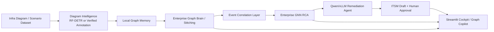

# InfraGraph AI

**Multimodal Infrastructure Diagram Intelligence + Enterprise Graph RCA + Agentic Remediation on AMD ROCm**

InfraGraph AI converts static infrastructure diagrams into graph memory that operations teams can query, correlate, and act on.
It detects and understands topology components, builds local topology graphs, and stitches them into an enterprise graph brain.
It correlates alert events, performs topology-aware RCA, and ranks cross-diagram root causes with an Enterprise GNN RCA model.
It uses local open-source Qwen served through vLLM for grounded remediation planning after RCA evidence is available.
It includes a controlled agentic operations flow with ITSM draft generation and a human approval gate.
It was built for the TCS & AMD AI Hackathon using open-source models and AMD ROCm-ready inference and alignment workflows.

## 1. Why This Matters

NOC, SRE, platform, and infrastructure teams usually receive alerts, tickets, diagrams, runbooks, and tribal knowledge in separate systems. Static architecture diagrams are visually useful but not machine-readable, so every major incident still requires humans to map alerts back to topology dependencies by hand.

InfraGraph AI turns diagrams into an operational graph brain. Instead of asking an LLM to guess a root cause, the system extracts topology, builds graph memory, correlates alert evidence, and uses graph intelligence to produce explainable RCA candidates. The LLM is used downstream for remediation planning, not for inventing the diagnosis.

## 2. Hackathon Track Alignment

| Track | Fit |
|-------|-----|
| Primary: Agents / Agentic AI | A 9-step incident operations orchestrator moves from alert intake through RCA, remediation planning, ITSM draft, and human approval. |
| Secondary: Multimodal AI | Diagram intelligence ingests infrastructure images, detector output, verified annotations, OCR/connector evidence, and graph memory. |
| Additional: Fine-tuning / alignment | Qwen3 LoRA + GRPO/vERL alignment pipeline trains remediation behavior with graph-grounded reward functions. |

Relevant use-case alignment:

- Autonomous Incident Diagnosis & Resolution Agent
- Unified Observability & RCA Agent
- Intelligent Image & Signal Processing
- Telecom/NOC Copilot style operations assistant

## 3. What We Built

- **Diagram Intelligence:** infrastructure diagram ingestion, component detection, verified annotation overlays, node extraction, connector extraction, and graph-memory packet generation.
- **Graph Memory:** local topology graph creation, graph-memory packets, enterprise graph absorption, and scenario graph stitching.
- **Event Correlation:** deterministic correlation across temporal, topology, alert-sequence, source/peer, and cross-diagram dimensions.
- **RCA:** local topology RCA plus Enterprise GNN RCA with GraphSAGE node ranking over stitched enterprise graphs.
- **Graph Copilot:** evidence-grounded Q&A over topology, RCA, impact paths, blast radius, and graph-memory facts.
- **AI Remediation:** Qwen/vLLM remediation planner that produces structured JSON from RCA, graph evidence, alert timelines, retrieved KB evidence, and guardrails.
- **Agentic Ops Orchestrator:** 9-step flow from alert intake to approval-gated action.
- **ITSM Draft:** local demo incident ticket generation; no external ITSM call is made by default.
- **Human Approval:** remediation is not auto-executed without operator approval.

## 4. End-to-End Architecture



## 5. Demo Flow

1. Launch the Streamlit cockpit.
2. Open **Diagram Intelligence**.
3. Select or onboard a diagram.
4. Generate the graph memory packet.
5. Move to **Topology RCA**.
6. Absorb the diagram into the **Enterprise Graph Brain**.
7. Run **Enterprise GNN RCA**.
8. Ask Graph Copilot RCA, impact, and blast-radius questions.
9. Run the **Agentic Ops Orchestrator**.
10. Review the remediation plan, ITSM draft, and human approval gate.

## 6. AI/ML Components

| Layer | Model / Method | Purpose | Output |
|-------|----------------|---------|--------|
| Diagram understanding | RF-DETR detector-supported flow with verified annotation fallback | Locate infrastructure components and produce graph-ready evidence when live detector inference is unavailable | Detected nodes, overlays, clean annotations, graph memory packet |
| Topology graph generation | Graph construction from nodes and connectors | Convert diagram evidence into local topology | Local graph JSON, nodes, edges |
| Event correlation | Deterministic scoring across temporal, topology, alert-sequence, source/peer, and cross-diagram dimensions | Group observable alerts before RCA without leaking labels | Correlated event clusters and causal evidence IDs |
| Local RCA | Engineered graph features and topology-aware node ranking | Rank likely root-cause nodes inside one diagram | Root-cause candidate list and reasoning path |
| Enterprise RCA | GraphSAGE Enterprise GNN | Rank root causes across stitched multi-diagram enterprise graphs | Cross-diagram root-cause ranking |
| Remediation generation | Qwen3 served through vLLM | Produce grounded validation, remediation, rollback, escalation, and ITSM-ready JSON after RCA | Structured remediation plan |
| Alignment | Qwen3 LoRA + GRPO/vERL pipeline on AMD ROCm | Align remediation responses to graph grounding, safety, rollback, and ITSM structure | LoRA adapter artifacts and training evidence |
| Vector memory | Chroma local vector memory | Retrieve SOP, graph, RCA, and incident evidence for Graph Copilot and remediation context | Evidence chunks and retrieval IDs |

## 7. AMD / ROCm Relevance

InfraGraph AI is designed for AMD GPU cloud and ROCm-compatible workflows:

- Qwen remediation runs through a local vLLM OpenAI-compatible endpoint.
- The GRPO/vERL alignment pipeline lives under `training/verl_grpo/`.
- ROCm setup and run helpers are under `scripts/amd_rocm/`.
- Evidence under `docs/evidence/amd_qwen3_grpo_run/` records a completed real vERL training run for Qwen/Qwen3-4B with LoRA rank 16, GRPO, vLLM rollout backend, FSDP actor strategy, and HIP version `7.0.51831-a3e329ad8`.
- `training/verl_grpo/runs/qwen3_4b_grpo_lora_amd/completion_evidence.md` records completed training at 32/32 steps on an AMD ROCm GPU, with observed GPU utilization, VRAM, and power telemetry.
- `assets/preloaded/enterprise_gnn_rca/enterprise_gnn_metrics.json` records a preloaded enterprise RCA model run with `torch_version` `2.6.0+rocm6.1`, `torch_hip_version` `6.1.40091-a8dbc0c19`, and AMD GPU device metadata.

The project should be described as **ROCm-ready with committed evidence of AMD ROCm training runs**. It should not be described as a production incident automation system.

## 8. Model Artifacts and Adapter Status

LoRA/GRPO adapter artifacts are available under `model_artifacts/`. The primary exported GRPO adapter folder is:

```text
model_artifacts/qwen3_grpo_lora_adapter/
```

The adapter is considered available only when both files exist in the same target folder:

- `adapter_model.safetensors`
- `adapter_config.json`

Verify adapter artifacts:

```bash
find model_artifacts -name "adapter_model.safetensors" -o -name "adapter_config.json"
export INFRAGRAPH_LORA_ADAPTER_PATH=model_artifacts/qwen3_grpo_lora_adapter
```

PowerShell equivalent:

```powershell
Get-ChildItem -Recurse model_artifacts -Include adapter_model.safetensors,adapter_config.json
$env:INFRAGRAPH_LORA_ADAPTER_PATH = "model_artifacts/qwen3_grpo_lora_adapter"
```

The app can read `INFRAGRAPH_LORA_ADAPTER_PATH` for adapter-aware status and configuration. For live fine-tuned inference, the vLLM server must also be launched with LoRA support for the adapter being served.

Other committed model artifacts include:

- `model_artifacts/rfdetr_v3/checkpoint_best_total.pth`
- `model_artifacts/rfdetr_v3/checkpoint_best_regular.pth`
- `model_artifacts/rfdetr_v3/checkpoint_best_ema.pth`
- `model_artifacts/enterprise_gnn_rca/enterprise_gnn_rca.pt`
- `model_artifacts/topology_rca/topology_rca_model.joblib`
- `model_artifacts/qwen_lora/infragraph_sop_grounded/`

## 9. Results and Evidence

Only committed repo evidence is listed here.

| Component | Evidence file | Metric / result | Notes |
|-----------|---------------|-----------------|-------|
| V3 annotation QA | `reports/v3_annotation_qa/annotation_quality_report.json` | 329 diagrams, 2,996 objects, 2,992 connectors, recommendation `DISPLAY_ONLY_FIX` | Supports verified annotation fallback and detector training readiness. |
| Topology RCA | `reports/topology_rca/eval_metrics.json` | 16 cases, 150 node rows, top-1 `1.0`, top-3 `1.0`, MRR `1.0` | Synthetic benchmark. |
| Enterprise GNN RCA, GraphSAGE path | `reports/enterprise_gnn_rca/evaluation.json` | Train/val/test cases `64/8/8`; test top-1 `1.0`, top-3 `1.0`, MRR `1.0`; best val MRR `1.0` | Model artifact in `model_artifacts/enterprise_gnn_rca/`. Synthetic enterprise benchmark. |
| Enterprise RCA preloaded demo model | `assets/preloaded/enterprise_gnn_rca/enterprise_gnn_metrics.json` | 80 epochs; test top-1 `1.0`, top-3 `1.0`, MRR `1.0`; ROCm torch metadata present | Preloaded cockpit artifact, recorded as Enterprise GCN RCA. |
| V2 learned RCA baselines | `assets/preloaded/mlp_rca/mlp_rca_metrics.json`, `assets/preloaded/gnn_rca/gnn_rca_metrics.json` | MLP test top-1/top-3/MRR `1.0/1.0/1.0`; GNN test top-1/top-3/MRR `1.0/1.0/1.0` | Synthetic V2 benchmark. |
| KB / vector memory index | `reports/kb_index/build_summary.json` | 8 documents loaded, 73 chunks indexed, collection `infragraph_sop_kb` | Local Chroma/SOP retrieval evidence. |
| GRPO reward evaluation | `training/verl_grpo/reward_eval_report.json` | 16 eval records; average chosen score `0.8931`; average rejected score `0.2075`; positive margin `16/16` | Reward checks JSON structure, root-cause match, grounding, rollback safety, escalation, and ITSM fields. |
| GRPO/vERL training run | `docs/evidence/amd_qwen3_grpo_run/training_summary.md` | Real vERL training run completed; Qwen/Qwen3-4B, LoRA rank 16, GRPO, global step 32 evidence | AMD ROCm training evidence. |
| Exported Qwen3 GRPO adapter | `model_artifacts/qwen3_grpo_lora_adapter/README.md` | Exported from vERL/FSDP actor checkpoint at `global_step_32`; LoRA rank 16, alpha 32 | Adapter files are present in the folder. |
| RF-DETR detector artifacts | `model_artifacts/rfdetr_v3/` | Checkpoints committed locally: best total, regular, and EMA | Detector evaluation metric not committed in the inspected reports; regenerate with `python scripts/run_rfdetr_inference.py` as needed. |
| Sample RCA outputs | `assets/preloaded/enterprise_gnn_rca/`, `outputs/enterprise_gnn_rca/` | Per-scenario RCA JSON files are present | Generated demo/inference artifacts. |

## 10. How To Run

### App Demo

Windows PowerShell:

```powershell
python -m venv .venv
.\.venv\Scripts\Activate.ps1
python -m pip install --upgrade pip
python -m pip install -r requirements/requirements-streamlit.txt
python -m streamlit run app/streamlit_app.py
```

Bash:

```bash
python -m venv .venv
source .venv/bin/activate
python -m pip install --upgrade pip
python -m pip install -r requirements/requirements-streamlit.txt
python -m streamlit run app/streamlit_app.py
```

Optional detector/runtime packages:

```bash
python -m pip install -r requirements/requirements-vision.txt
python -m pip install -r requirements/requirements-rfdetr-runtime.txt
```

Build local vector memory:

```bash
python scripts/build_vector_memory.py \
  --repo-root . \
  --persist-dir ./runtime_state/vector_memory/chroma \
  --collection infragraph_memory
```

Build SOP KB index used by remediation retrieval:

```bash
python scripts/build_kb_index.py
```

### Enterprise GNN RCA

Build the graph dataset, train the GraphSAGE Enterprise GNN, and run inference:

```bash
python scripts/build_enterprise_gnn_dataset.py \
  --scenario-library scenario_library \
  --out-dir data/rca/enterprise_gnn

python scripts/train_enterprise_gnn_rca.py \
  --graphs data/rca/enterprise_gnn/graphs.pt \
  --index data/rca/enterprise_gnn/graph_index.json \
  --out-dir model_artifacts/enterprise_gnn_rca \
  --report-dir reports/enterprise_gnn_rca \
  --epochs 80

python scripts/run_enterprise_gnn_inference.py \
  --scenario-id enterprise_v3_0077 \
  --model-path model_artifacts/enterprise_gnn_rca/enterprise_gnn_rca.pt \
  --out outputs/enterprise_gnn_rca
```

If `torch_geometric` is missing on an AMD ROCm node, use the repo helper:

```bash
bash scripts/amd_rocm/bootstrap_rca_gnn_env.sh
```

### Qwen/vLLM Remediation

Start a local vLLM server for Qwen3:

```bash
python -m vllm.entrypoints.openai.api_server \
  --model Qwen/Qwen3-4B \
  --host 0.0.0.0 \
  --port 8000
```

Point InfraGraph AI at the server:

```bash
export INFRAGRAPH_QWEN_BASE_URL=http://localhost:8000/v1
export INFRAGRAPH_QWEN_MODEL=Qwen/Qwen3-4B
export INFRAGRAPH_LORA_ADAPTER_PATH=model_artifacts/qwen3_grpo_lora_adapter
python -m streamlit run app/streamlit_app.py
```

PowerShell:

```powershell
$env:INFRAGRAPH_QWEN_BASE_URL = "http://localhost:8000/v1"
$env:INFRAGRAPH_QWEN_MODEL = "Qwen/Qwen3-4B"
$env:INFRAGRAPH_LORA_ADAPTER_PATH = "model_artifacts/qwen3_grpo_lora_adapter"
python -m streamlit run app/streamlit_app.py
```

Template fallback mode is available when no Qwen endpoint is configured, but live Qwen/vLLM is the intended demo path.

### GRPO/vERL Alignment Pipeline

Prepare the AMD ROCm GRPO environment:

```bash
bash scripts/amd_rocm/bootstrap_grpo_env.sh
bash scripts/amd_rocm/patch_verl_runtime_for_rocm.sh
```

Build and evaluate the alignment dataset:

```bash
python training/verl_grpo/build_rca_rl_dataset.py \
  --dataset-root ./datasets/infragraph_v3 \
  --gnn-results ./assets/preloaded/enterprise_gnn_rca \
  --out ./training/verl_grpo/data

python training/verl_grpo/prepare_verl_dataset.py
python training/verl_grpo/reward_functions.py
```

Run the GRPO training script:

```bash
# Dry-run / command inspection
bash training/verl_grpo/train_qwen3_grpo.sh

# Real vERL run
INFRAGRAPH_RUN_REAL_VERL=1 bash training/verl_grpo/train_qwen3_grpo.sh
```

Export/check adapter artifacts:

```bash
python training/verl_grpo/find_lora_adapter_artifacts.py \
  --run-dir training/verl_grpo/runs/qwen3_4b_grpo_lora_amd_saved

python training/verl_grpo/export_lora_adapter.py \
  --run-dir training/verl_grpo/runs/qwen3_4b_grpo_lora_amd_saved \
  --base-model Qwen/Qwen3-4B \
  --output-dir model_artifacts/qwen3_grpo_lora_adapter

find model_artifacts -name "adapter_model.safetensors" -o -name "adapter_config.json"
```

## 11. Repository Structure

```text
infragraph-ai/
+-- app/                       Streamlit cockpit for diagram intelligence, graph brain, RCA, copilot, and orchestration.
+-- src/runtime_ingestion.py   Runtime ingestion and absorption APIs used by the cockpit.
+-- src/incident_simulation/   Deterministic local and enterprise incident builders.
+-- src/event_correlation/     Alert clustering and causal evidence without RCA/remediation label leakage.
+-- src/rca_ml/                Feature engineering, topology RCA, Enterprise GNN dataset/model/inference.
+-- src/ai_remediation/        Qwen/vLLM client, prompt builder, context builder, schemas, and template fallback.
+-- src/agents/                Agentic Ops Orchestrator, tools, and structured schemas.
+-- src/graph_copilot/         Evidence-grounded graph query engine.
+-- scripts/                   CLI pipeline scripts for datasets, detectors, RCA, vector memory, and ROCm setup.
+-- training/verl_grpo/        Qwen3 LoRA + GRPO/vERL alignment pipeline and reward functions.
+-- model_artifacts/           Local detector, RCA, and Qwen LoRA artifacts.
+-- datasets/                  Synthetic V1/V2/V3 diagram and enterprise topology datasets.
+-- reports/                   Evaluation reports, annotation QA, KB index summaries, and training evidence.
+-- outputs/                   Generated inference/demo outputs and legacy compatibility artifacts.
+-- assets/                    Product-facing manifests, preloaded demo artifacts, overlays, and sample outputs.
+-- requirements/              Dependency tiers for app, RAG, vision, training, ROCm, and orchestrator workflows.
```

## 12. Honest Claims / Guardrails

- RCA is graph/GNN-driven; the LLM is not used to invent root cause.
- Qwen is used after RCA for remediation planning, validation steps, rollback notes, escalation, and ITSM-ready summaries.
- Remediation is approval-gated and not auto-executed.
- Demo ITSM tickets are generated locally; no external ITSM API call is made unless integrated later.
- Verified annotation fallback is clearly labelled when live detector inference is unavailable.
- Synthetic datasets are used for controlled enterprise topology/RCA experiments.
- Metrics above are based on synthetic benchmarks unless otherwise stated.
- RF-DETR checkpoints are present, but detector evaluation metrics should only be claimed after running and committing the relevant evaluation report.

## 13. Future Roadmap

- Live observability integration with alert streams from real monitoring systems.
- Real CMDB and ITSM integrations with authenticated create/update flows.
- Stronger diagram OCR and connector extraction across diverse architecture drawing styles.
- Larger enterprise graph scenarios with more noisy and incomplete topology evidence.
- Full adapter export and vLLM LoRA deployment automation.
- Production-grade policy controls for remediation approval, change windows, and rollback enforcement.

## License

MIT
