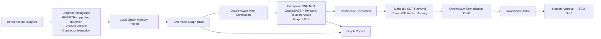

# InfraGraph AI

**Multimodal Infrastructure Diagram Intelligence + Enterprise Graph RCA + Governed Agentic Remediation**

InfraGraph AI is a graph-native Agentic AIOps reference implementation that converts static infrastructure diagrams into machine-readable graph memory, correlates alert storms, ranks root cause with graph and GNN intelligence, and uses an LLM only downstream for runbook-grounded remediation drafting.

It is best understood as a portfolio-grade prototype and reusable enterprise AIOps architecture, not a production incident automation system.

## Why InfraGraph AI Exists

Infrastructure teams often debug incidents from fragmented evidence: architecture diagrams, monitoring alerts, runbooks, RCA notes, CMDB fragments, and tribal knowledge. Static diagrams are useful for humans but difficult for software systems to reason over.

InfraGraph AI turns those diagrams into an operational graph layer. Instead of asking an LLM to guess a diagnosis, it extracts topology, builds graph memory, correlates alerts against dependency context, ranks root-cause candidates with graph/GNN methods, and then uses Qwen/vLLM only to draft a remediation plan grounded in RCA evidence and runbooks.

## What It Does

- Ingests infrastructure diagrams and extracts devices, metadata, and topology edges.
- Builds local graph-memory packets and stitches them into an enterprise graph brain.
- Correlates alert storms using temporal, severity, service, topology, and graph-proximity signals.
- Ranks root cause with deterministic graph features and Enterprise GNN RCA models.
- Calibrates RCA confidence before remediation.
- Retrieves root-cause-aware runbooks/SOPs with local vector memory.
- Uses Qwen/vLLM after RCA to draft validation, remediation, rollback, escalation, and ITSM-ready summaries.
- Validates remediation with a governance critic.
- Keeps remediation human approval-gated and non-executing by default.

Guardrail: **Qwen/vLLM does not decide root cause.** RCA is graph/GNN-driven; the LLM is downstream remediation drafting AI.

## Architecture


```mermaid
flowchart LR
    A[Infrastructure Diagram] --> B[Diagram Intelligence<br/>RF-DETR-supported detection<br/>Verified fallback<br/>Connector extraction]
    B --> C[Local Graph Memory Packet]
    C --> D[Enterprise Graph Brain]
    D --> E[Graph-Aware Alert Correlation]
    E --> F[Enterprise GNN RCA<br/>GraphSAGE + Temporal Relation-Aware GraphSAGE]
    F --> G[Confidence Calibration]
    G --> H[Runbook / SOP Retrieval<br/>ChromaDB Vector Memory]
    H --> I[Qwen/vLLM Remediation Draft]
    I --> J[Governance Critic]
    J --> K[Human Approval + ITSM Draft]
    D --> L[Graph Copilot]
    F --> L
```

## Core Capabilities

| Area | Capability | Evidence paths |
|------|------------|----------------|
| Diagram intelligence | RF-DETR-supported diagram detection, bbox normalization, verified annotation fallback, and overlay generation | `src/runtime_ingestion.py`, `model_artifacts/rfdetr_v3/`, `reports/rfdetr_runtime_evidence/` |
| Vision connector extraction | OpenCV/Hough line detection with geometric endpoint-to-node matching | `src/vision/edge_extraction/` |
| Graph memory | Local graph extraction, graph-memory packets, shared entity mapping, and enterprise graph stitching | `src/runtime_ingestion.py`, `assets/preloaded/`, `runtime_state/` |
| Event correlation | Feature-driven alert similarity and clustering before RCA | `src/event_correlation/` |
| RCA feature engineering | 54-dimensional node features with topology, alert, temporal, propagation, and compatibility signals | `src/rca_ml/enterprise_gnn_dataset.py` |
| Enterprise GNN RCA V1 | GraphSAGE node ranking over stitched enterprise graphs | `model_artifacts/enterprise_gnn_rca/`, `reports/enterprise_gnn_rca/` |
| Enterprise GNN RCA V2 | Temporal-aware relation-aware GraphSAGE over local, cross-diagram, and vision connector edges | `src/rca_ml/enterprise_gnn_v2_model.py`, `model_artifacts/enterprise_gnn_rca_v2/` |
| Confidence calibration | Heuristic RCA confidence gate using source quality, candidate margin, evidence density, and impacted diagrams | `src/rca_ml/calibration.py` |
| Runbook retrieval | Root-cause-aware runbook/SOP retrieval, reranking, and policy filtering | `src/runbook_retrieval/` |
| Remediation drafting | Qwen/vLLM JSON remediation draft with validation, remediation, rollback, escalation, and ITSM-ready summary | `src/ai_remediation/`, `training/verl_grpo/` |
| Governance | Rule/evidence critic for RCA source, confidence, runbook chain, rollback, validation-before-remediation, and approval gate | `src/governance/evidence_critic.py` |
| Graph Copilot | Deterministic graph query + local Chroma retrieval + optional Qwen fallback answer | `src/graph_copilot/`, `src/vector_memory/`, `reports/kb_index/` |

## How RCA Works

InfraGraph AI uses a layered RCA stack:

1. **Topology-aware deterministic RCA:** graph paths, centrality, dependency direction, distance-to-alert, source/sink role, and reverse reachability.
2. **Engineered RCA features:** 54-dimensional node feature tensors combining topology, alert, temporal, propagation, and compatibility signals.
3. **Enterprise GNN RCA V1:** GraphSAGE learns root-cause ranking over stitched enterprise graphs.
4. **Enterprise GNN RCA V2:** Temporal-aware relation-aware GraphSAGE separates local, cross-diagram, and vision-extracted connector edges during message passing.
5. **Confidence calibration:** RCA confidence is calibrated before approval.
6. **Governance validation:** RCA/remediation evidence is validated before ITSM draft and human approval.

## Why The LLM Is Downstream Only

The LLM receives RCA context after graph/GNN analysis has already selected or ranked root-cause candidates. Its job is to produce a grounded remediation draft:

- validation steps before remediation,
- remediation steps,
- rollback and safety notes,
- escalation guidance,
- ITSM-ready summary,
- references to graph/runbook evidence.

The LLM is not allowed to invent devices, invent topology, or decide root cause. Template fallback mode is available when no Qwen/vLLM endpoint is configured.

## Safety And Governance Model

- RCA is graph/GNN-driven.
- Remediation is confidence-gated.
- Runbooks/SOPs are retrieved and policy-filtered before remediation drafting.
- Governance critic checks evidence, RCA source, confidence, validation-before-remediation, rollback, and approval readiness.
- ITSM tickets are local drafts by default.
- No live infrastructure action is executed by default.
- Human approval remains required before any operational action.

## Quickstart

### Streamlit Cockpit

Windows PowerShell:

```powershell
python -m venv .venv
.\.venv\Scripts\Activate.ps1
python -m pip install --upgrade pip
python -m pip install -r requirements/requirements-streamlit.txt
python -m streamlit run app/streamlit_app.py
```

Bash:

```bash
python -m venv .venv
source .venv/bin/activate
python -m pip install --upgrade pip
python -m pip install -r requirements/requirements-streamlit.txt
python -m streamlit run app/streamlit_app.py
```

Optional detector/runtime packages:

```bash
python -m pip install -r requirements/requirements-vision.txt
python -m pip install -r requirements/requirements-rfdetr-runtime.txt
```

Build local vector memory:

```bash
python scripts/build_vector_memory.py \
  --repo-root . \
  --persist-dir ./runtime_state/vector_memory/chroma \
  --collection infragraph_memory
```

Build SOP KB index:

```bash
python scripts/build_kb_index.py
```

### Recommended Demo Flow

1. Launch the Streamlit cockpit.
2. Open **Diagram Intelligence**.
3. Select or onboard a diagram.
4. Generate the graph memory packet.
5. Review extracted nodes, connector extraction source, and graph edges.
6. Absorb graph memory into the **Enterprise Graph Brain**.
7. Run **Enterprise GNN RCA**.
8. Open **Agentic Ops Orchestrator**.
9. Select a curated enterprise incident scenario.
10. Run graph-aware correlation.
11. Combine alerts into incident clusters.
12. Generate AI Findings for a selected cluster.
13. Review the RCA source, root-cause candidate, confidence calibration, and impacted diagrams.
14. Generate a Qwen/vLLM remediation draft or deterministic fallback draft.
15. Review governance findings, rollback notes, human approval, and local ITSM draft.
16. Ask Graph Copilot: "Why was this node selected as root cause?"

### Enterprise GNN RCA

```bash
python scripts/build_enterprise_gnn_dataset.py \
  --scenario-library scenario_library \
  --out-dir data/rca/enterprise_gnn

python scripts/train_enterprise_gnn_rca.py \
  --graphs data/rca/enterprise_gnn/graphs.pt \
  --index data/rca/enterprise_gnn/graph_index.json \
  --out-dir model_artifacts/enterprise_gnn_rca \
  --report-dir reports/enterprise_gnn_rca \
  --epochs 80

python scripts/run_enterprise_gnn_inference.py \
  --scenario-id enterprise_v3_0077 \
  --model-path model_artifacts/enterprise_gnn_rca/enterprise_gnn_rca.pt \
  --out outputs/enterprise_gnn_rca
```

Train and run Enterprise GNN RCA V2:

```bash
python scripts/build_enterprise_gnn_dataset.py
python scripts/train_enterprise_gnn_v2_rca.py --epochs 80 --eval-every 5 --hidden-dim 64 --num-layers 2
python scripts/run_enterprise_gnn_v2_inference.py --scenario-id enterprise_v3_0079 --split test
```

### Qwen/vLLM Remediation

Base Qwen mode:

```bash
python -m vllm.entrypoints.openai.api_server \
  --model Qwen/Qwen3-4B \
  --host 0.0.0.0 \
  --port 8000

export INFRAGRAPH_QWEN_BASE_URL=http://localhost:8000/v1
export INFRAGRAPH_QWEN_MODEL=Qwen/Qwen3-4B
python -m streamlit run app/streamlit_app.py
```

Adapter-aware mode:

```bash
python -m vllm.entrypoints.openai.api_server \
  --model Qwen/Qwen3-4B \
  --enable-lora \
  --lora-modules infragraph-grpo=model_artifacts/qwen3_grpo_lora_adapter \
  --host 0.0.0.0 \
  --port 8000

export INFRAGRAPH_QWEN_BASE_URL=http://localhost:8000/v1
export INFRAGRAPH_QWEN_MODEL=Qwen/Qwen3-4B
export INFRAGRAPH_LORA_ADAPTER_PATH=model_artifacts/qwen3_grpo_lora_adapter
python -m streamlit run app/streamlit_app.py
```

### Large Model Artifacts / Git LFS

Some model artifacts are stored using Git LFS, including `.safetensors`, `.pt`, `.pth`, and detector checkpoints.

```bash
git lfs install
git lfs pull
find model_artifacts -name "adapter_model.safetensors" -o -name "adapter_config.json"
```

Without `git lfs pull`, a clone may contain only pointer files for large model artifacts.

## Optional GPU Acceleration Notes

The base Streamlit app and deterministic workflows can run on CPU. GPU-enabled environments are useful for:

- faster GNN training/inference,
- local vLLM model serving,
- Qwen LoRA/GRPO/vERL experiments,
- accelerated detector inference.

Optional hardware-specific setup notes and helper scripts are kept outside the core project narrative:

- Hardware-specific accelerator setup is kept separate from the default install path.
- The default app, RCA pipeline, and graph memory workflows run without those optional accelerator helpers.
- Hardware-specific execution evidence is retained under optional evidence/archive folders and is not required for the default app demo.

## Repository Structure

```text
infragraph-ai/
+-- app/                         Streamlit cockpit for graph memory, RCA, copilot, and orchestration.
+-- src/runtime_ingestion.py     Runtime ingestion and absorption APIs.
+-- src/event_correlation/       Alert clustering and graph-aware correlation.
+-- src/rca_ml/                  Feature engineering, topology RCA, Enterprise GNN models, and inference.
+-- src/ai_remediation/          Qwen/vLLM client, prompt builder, schemas, and deterministic fallback.
+-- src/agents/                  Agentic Ops Orchestrator and typed execution schemas.
+-- src/graph_copilot/           Evidence-grounded graph query engine.
+-- src/runbook_retrieval/       Runbook/SOP retrieval, reranking, and policy filtering.
+-- src/governance/              Evidence critic and approval-readiness validator.
+-- src/vision/edge_extraction/  OpenCV/Hough connector extraction.
+-- scripts/                     Dataset, detector, RCA, vector memory, and optional runtime helpers.
+-- training/verl_grpo/          Qwen3 LoRA + GRPO/vERL alignment pipeline and reward functions.
+-- model_artifacts/             Local detector, RCA, and Qwen adapter artifacts.
+-- datasets/                    Synthetic/generated diagram and enterprise topology datasets.
+-- reports/                     Evaluation reports, annotation QA, KB index summaries, and diagnostics.
+-- outputs/                     Generated inference outputs.
+-- assets/                      Preloaded sample artifacts and product manifests.
+-- requirements/                Dependency tiers for app, RAG, vision, training, and optional runtimes.
```

## Evidence And Benchmarks

| Component | Evidence file | Metric / result | Caveat |
|-----------|---------------|-----------------|--------|
| V3 annotation QA | `reports/v3_annotation_qa/annotation_quality_report.json` | 329 diagrams, 2,996 objects, 2,992 connectors | Supports verified annotation fallback and detector training readiness. |
| Topology RCA | `reports/topology_rca/eval_metrics.json` | 16 cases, top-1 `1.0`, top-3 `1.0`, MRR `1.0` | Synthetic benchmark. |
| Enterprise GNN RCA V1 | `reports/enterprise_gnn_rca/evaluation.json` | Train/val/test `64/8/8`; test top-1/top-3/MRR `1.0` | Synthetic/generated enterprise benchmark. |
| Enterprise GNN RCA V2 | `model_artifacts/enterprise_gnn_rca_v2/training_report.json` | 80 graphs, epochs `80`, uses edge type and temporal features, synthetic test top-1/top-3/MRR `1.0` | Controlled generated benchmark; not production accuracy. |
| Curated V2 RCA output | `outputs/enterprise_gnn_rca_v2/enterprise_v3_0079_enterprise_gnn_v2_rca_result.json` | Predicted root `DC-FW-01`, cross-diagram edges `8` | Example inference output for a generated scenario. |
| Graph-aware correlation | `src/event_correlation/` | Alerts enriched with `correlation_group`, `correlation_score`, and explanations | Pre-RCA clustering. |
| Confidence calibration | `src/rca_ml/calibration.py` | Calibrated confidence and `0.75` threshold gate | Heuristic gate, not a production risk model. |
| Governance critic | `src/governance/evidence_critic.py` | Validates RCA/remediation chain | Prevents unguided LLM remediation. |
| Vision connector extraction | `src/vision/edge_extraction/` | Hough segments + endpoint matching + confidence fallback | Hybrid CV extraction with metadata fallback. |
| Vector memory | `reports/kb_index/build_summary.json` | 8 documents, 73 chunks, collection `infragraph_sop_kb` | Local Chroma/SOP retrieval evidence. |
| GRPO reward evaluation | `training/verl_grpo/reward_eval_report.json` | 16 eval records; positive margin `16/16` | Reward checks grounding, rollback, escalation, and ITSM structure. |
| Qwen adapter | `model_artifacts/qwen3_grpo_lora_adapter/` | LoRA adapter metadata and artifacts | Adapter serving requires vLLM LoRA support. |
| RF-DETR artifacts | `model_artifacts/rfdetr_v3/` | Checkpoints committed via Git LFS | Detector accuracy is not overclaimed; verified fallback is part of the design. |
| Runtime detector evidence | `reports/rfdetr_runtime_evidence/rfdetr_runtime_evidence.md` | Representative annotated outputs | Diagnostic/runtime evidence, not a production accuracy claim. |
| Performance metrics | `docs/evidence/performance_metrics/performance_metrics.md` | Latency, token, detector, and GPU runtime evidence where available | Hardware-specific telemetry is optional evidence. |

## Limitations

- This is a prototype/reference implementation, not production-ready incident automation.
- Synthetic/generated datasets are used for controlled validation; results should not be interpreted as production accuracy.
- Real enterprise topology, alert, and incident data are not claimed.
- Enterprise GNN RCA V2 is temporal-aware and relation-aware GraphSAGE, not a fully dynamic temporal heterogeneous graph transformer.
- RF-DETR checkpoints are present, but detector accuracy should only be claimed from completed evaluation reports.
- Vision connector extraction includes metadata fallback.
- Qwen/vLLM is downstream of RCA and does not decide root cause.
- Remediation is approval-gated and demo-safe by default; no live infrastructure execution is performed.

## Roadmap

- Live observability connectors for alert ingestion.
- CMDB and ITSM integrations with authenticated create/update flows.
- More robust OCR and connector extraction across diverse diagram styles.
- Larger generated enterprise graph scenarios with noisy/incomplete topology evidence.
- Broader model evaluation on external and real-world-style diagrams.
- Production-grade policy controls for change windows, approvals, and rollback enforcement.

## License

MIT
